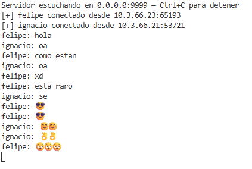
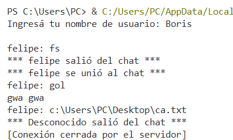

# Laboratorio N°3 Sistemas Operativos

## Integrantes
| Nombre |
|--------|
| Ignacio Araya |
| Felipe Segura |
| Boris Berrios |

---

## Descripción
Aplicación de chat en red desarrollada en Python utilizando **sockets TCP** y **threads**. El servidor atiende múltiples clientes simultáneamente, reenvía los mensajes a todos los participantes de la sala y solicita un nombre de usuario al conectarse.

## Archivos
| Archivo | Descripción |
|---------|-------------|
| `servidor.py` | Servidor de chat concurrente (multi-cliente con threads) |
| `cliente.py` | Cliente de chat con hilo receptor independiente |

## Requisitos
- Python 3.x
- Sin dependencias externas (solo biblioteca estándar)

## Cómo ejecutar

### Servidor
```bash
python servidor.py
```

### Cliente (mismo PC)
```bash
python cliente.py
```

### Cliente (desde otro PC en la red)
Editá la variable `HOST` en `cliente.py` con la IP real del servidor:
```python
HOST = "10.3.66.21"  # Ejemplo: IP del servidor en la red local
```
Luego ejecutá:
```bash
python cliente.py
```
> Para obtener la IP del servidor en Windows ejecutá `ipconfig` en cmd y buscá la dirección IPv4 de tu adaptador de red.

---

## Demo



---

## Conclusiones

1. **Sockets como abstracción de red.**  
   El módulo `socket` de Python proporciona una interfaz de bajo nivel para comunicación bidireccional entre procesos. El par `(IP, puerto)` identifica unívocamente un extremo de la conexión y TCP garantiza entrega ordenada de los datos.

2. **Necesidad de concurrencia en servidores.**  
   El servidor original bloqueaba en `accept()` tras atender un único cliente. Incorporar `threading.Thread` por cada conexión entrante permite atender múltiples clientes en paralelo sin que uno bloquee al otro.

3. **Estado compartido requiere sincronización.**  
   La lista de clientes activos es accedida por múltiples hilos simultáneamente. Sin un `threading.Lock`, una desconexión concurrente puede corromper la lista o enviar mensajes a un socket ya cerrado. El lock garantiza exclusión mutua en las secciones críticas.

4. **Separación de hilos en el cliente.**  
   Para recibir mensajes mientras se espera input del usuario es necesario un hilo receptor independiente. Sin él, la lectura de teclado bloquea la recepción de mensajes entrantes.

5. **Manejo robusto de errores de red.**  
   Las excepciones `OSError` son inevitables cuando un par se desconecta abruptamente. Envolver `recv`/`send` en `try-except` y limpiar la lista en el bloque `finally` evita que el servidor crashee y mantiene coherente el estado interno.

---

## Observaciones

- Se recomienda usar `0.0.0.0` en el `bind` del servidor para escuchar en todas las interfaces disponibles. El cliente debe apuntar a `127.0.0.1` para conexiones locales o a la IP real del servidor para conexiones desde otra máquina en la red.

- La opción **`SO_REUSEADDR`** en el socket del servidor es indispensable durante el desarrollo: sin ella, reiniciar el servidor dentro del tiempo de espera TCP (`TIME_WAIT`) arroja `Address already in use`.

- El protocolo **TCP no garantiza límites de mensaje**. En este laboratorio cada mensaje cabe en menos de 1024 bytes, pero en producción sería necesario un protocolo de framing (longitud prefijada o delimitador) para evitar mensajes parciales o combinados.

- La arquitectura implementada es **servidor centralizado** *(star topology)*: todos los mensajes pasan por el servidor. Una arquitectura peer-to-peer descentralizada requeriría que cada cliente actuara también como servidor.
